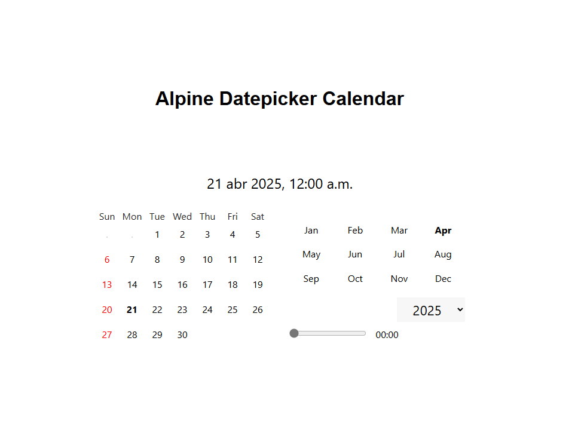

# Alpine Datepicker Calendar

A lightweight and fully functional datepicker/calendar built using [Alpine.js](https://alpinejs.dev/) and [Luxon](https://moment.github.io/luxon/). This component supports date and time selection with intuitive controls and minimal dependencies.

## Features

- 📅 Dynamic calendar rendering (days, weekdays, months, years)
- ⏰ Time range slider (customizable from 7:00 to 22:00)
- 🧠 Smart handling of leap years and varying month lengths
- 📦 No external UI frameworks required (themed CSS and structure written in different files)
- 🧩 Built using Alpine.js v2 and Luxon
- 📆 Outputs both local and UTC date formats via hidden inputs
- ✨ Simple, modern, and responsive layout
- 🏆 And the most important, **meant to be confortable to use**!

## License

MIT
